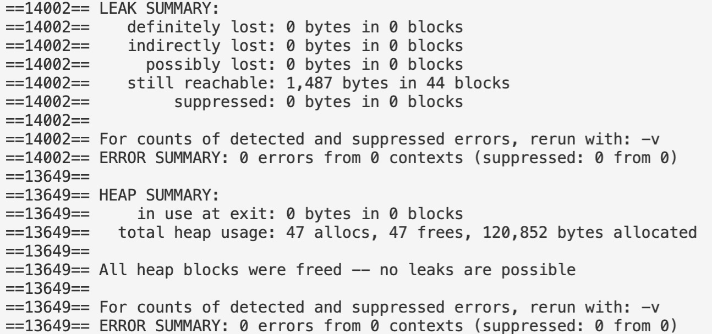

# LRII
Linux Resource Is Important 一个Linux的资源监控警报服务

# 安装软件包：

    Fedora、RedHat、CentOS :  yum install sysstat
    Ubuntu:                  apt-get install sysstat

# 启动：

    make
    .\app

# 内存泄漏：
    
客户端：
